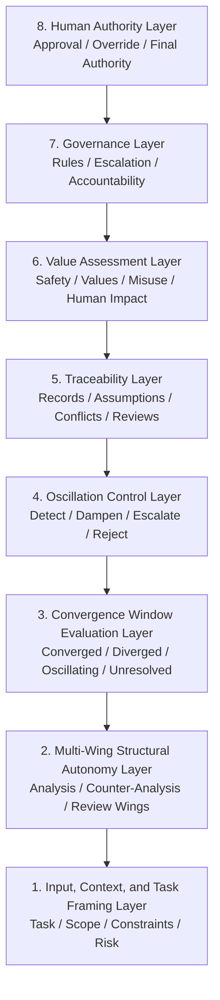
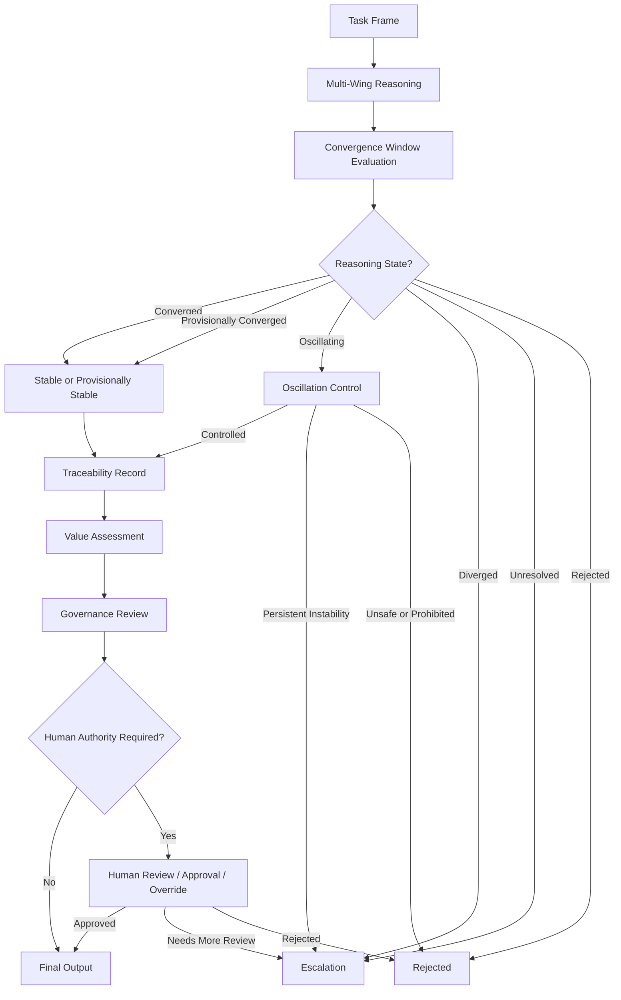
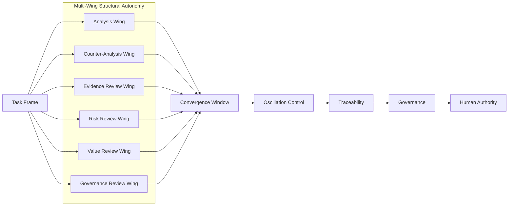
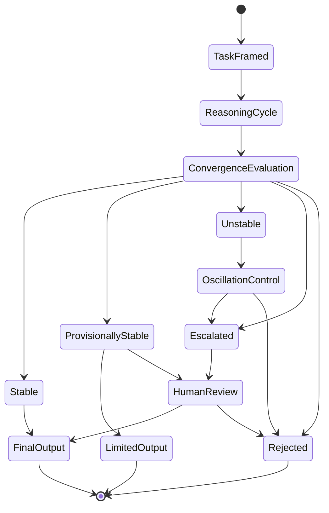

# Annex A: Architecture Diagram

**Document:** `annex/annex-a-architecture-diagram.md`
**Repository:** `ai-reasoning-stability-standard-wd0`
**Status:** Working Draft 0 annex
**Version:** WD0
**Date:** 2026-05-31

---

## A.1 Purpose

This annex provides architecture diagrams for the **AI Reasoning Stability Standard — Working Draft 0**.

The purpose of this annex is to visually describe how the major layers of the standard relate to one another.

This annex supports:

```text
standard/ai-reasoning-stability-standard-wd0.md
docs/architecture-model.md
docs/requirements.md
docs/conformance.md
docs/terminology.md
```

The diagrams are explanatory.

They do not define an official implementation architecture, certification model, or mandatory software stack.

---

## A.2 High-Level Layered Architecture

The AI Reasoning Stability Standard is organized as a layered reasoning-stability model.

```text
┌──────────────────────────────────────────────┐
│ 8. Human Authority Layer                      │
│    Human final authority, approval, override  │
├──────────────────────────────────────────────┤
│ 7. Governance Layer                           │
│    Rules, escalation, accountability, review  │
├──────────────────────────────────────────────┤
│ 6. Value Assessment Layer                     │
│    Safety, values, misuse, human impact       │
├──────────────────────────────────────────────┤
│ 5. Traceability Layer                         │
│    Records, assumptions, conflicts, reviews   │
├──────────────────────────────────────────────┤
│ 4. Oscillation Control Layer                  │
│    Detect, dampen, limit, escalate instability│
├──────────────────────────────────────────────┤
│ 3. Convergence Window Evaluation Layer        │
│    Evaluate convergence, divergence, status   │
├──────────────────────────────────────────────┤
│ 2. Multi-Wing Structural Autonomy Layer       │
│    Analysis, counter-analysis, review wings   │
├──────────────────────────────────────────────┤
│ 1. Input, Context, and Task Framing Layer     │
│    Task, scope, assumptions, constraints      │
└──────────────────────────────────────────────┘
```

---

## A.3 Layer Summary

| Layer | Name                                   | Primary Function                                                          |
| ----: | -------------------------------------- | ------------------------------------------------------------------------- |
|     8 | Human Authority Layer                  | Defines when human approval, override, or final authority is required.    |
|     7 | Governance Layer                       | Defines rules, review paths, escalation criteria, and accountability.     |
|     6 | Value Assessment Layer                 | Reviews reasoning against safety, values, misuse risk, and human impact.  |
|     5 | Traceability Layer                     | Records reasoning events, assumptions, conflicts, reviews, and decisions. |
|     4 | Oscillation Control Layer              | Detects and controls unstable reasoning fluctuation.                      |
|     3 | Convergence Window Evaluation Layer    | Evaluates whether reasoning has stabilized within a defined window.       |
|     2 | Multi-Wing Structural Autonomy Layer   | Separates reasoning roles into distinct wings or evaluative components.   |
|     1 | Input, Context, and Task Framing Layer | Defines task scope, context, constraints, assumptions, and risk.          |

---

## A.4 Process Flow Diagram

The following diagram shows a typical reasoning-stability flow.

```text
┌─────────────────────────────┐
│ 1. Task Frame                │
│ - task                       │
│ - context                    │
│ - assumptions                │
│ - constraints                │
│ - risk level                 │
└──────────────┬──────────────┘
               ↓
┌─────────────────────────────┐
│ 2. Multi-Wing Reasoning      │
│ - analysis                   │
│ - counter-analysis           │
│ - evidence review            │
│ - risk review                │
│ - value review               │
│ - governance review          │
└──────────────┬──────────────┘
               ↓
┌─────────────────────────────┐
│ 3. Convergence Window        │
│ - converged                  │
│ - provisionally converged    │
│ - diverged                   │
│ - unresolved                 │
│ - oscillating                │
└──────────────┬──────────────┘
               ↓
┌─────────────────────────────┐
│ 4. Oscillation Control       │
│ - continue                   │
│ - dampen                     │
│ - pause                      │
│ - request evidence           │
│ - escalate                   │
│ - reject                     │
└──────────────┬──────────────┘
               ↓
┌─────────────────────────────┐
│ 5. Traceability Record       │
│ - task frame                 │
│ - wing outputs               │
│ - conflicts                  │
│ - convergence result         │
│ - oscillation event          │
│ - review actions             │
└──────────────┬──────────────┘
               ↓
┌─────────────────────────────┐
│ 6. Value Assessment          │
│ - safety                     │
│ - fairness                   │
│ - misuse risk                │
│ - human impact               │
│ - domain constraints         │
└──────────────┬──────────────┘
               ↓
┌─────────────────────────────┐
│ 7. Governance Review         │
│ - permitted use              │
│ - escalation rules           │
│ - accountability             │
│ - prohibited automation      │
│ - audit readiness            │
└──────────────┬──────────────┘
               ↓
┌─────────────────────────────┐
│ 8. Human Authority           │
│ - advisory only              │
│ - human approval             │
│ - human override             │
│ - final decision             │
└──────────────┬──────────────┘
               ↓
┌─────────────────────────────┐
│ Final Status                 │
│ - stable output              │
│ - limited output             │
│ - escalated                  │
│ - rejected                   │
└─────────────────────────────┘
```

---

## A.5 Mermaid Diagram: Layered Model

The following Mermaid diagram may be rendered by platforms that support Mermaid.



---

## A.6 Mermaid Diagram: Reasoning Flow



---

## A.7 Mermaid Diagram: Multi-Wing to Stability Evaluation



---

## A.8 Stability State Diagram

The reasoning process may result in one of several stability states.

```text
                          ┌───────────────┐
                          │ Task Framed   │
                          └───────┬───────┘
                                  ↓
                          ┌───────────────┐
                          │ Reasoning     │
                          │ Cycle         │
                          └───────┬───────┘
                                  ↓
                          ┌───────────────┐
                          │ Convergence   │
                          │ Evaluation    │
                          └───────┬───────┘
                                  ↓
        ┌─────────────────────────┼─────────────────────────┐
        ↓                         ↓                         ↓
┌───────────────┐         ┌───────────────┐         ┌───────────────┐
│ Stable        │         │ Provisionally │         │ Unstable      │
│               │         │ Stable        │         │               │
└───────┬───────┘         └───────┬───────┘         └───────┬───────┘
        ↓                         ↓                         ↓
┌───────────────┐         ┌───────────────┐         ┌───────────────┐
│ Output        │         │ Limited Output│         │ Escalation    │
│ Permitted     │         │ or Review     │         │ or Rejection  │
└───────────────┘         └───────────────┘         └───────────────┘
```

---

## A.9 Mermaid Diagram: Stability State Flow



---

## A.10 Cross-Layer Responsibility Matrix

| Function               | Task Frame | Multi-Wing | Convergence Window | Oscillation Control | Traceability | Value Assessment | Governance |      Human Authority |
| ---------------------- | ---------: | ---------: | -----------------: | ------------------: | -----------: | ---------------: | ---------: | -------------------: |
| Define scope           |        Yes |         No |                 No |                  No |       Record |               No |     Review |    Approve if needed |
| Generate reasoning     |         No |        Yes |                 No |                  No |       Record |               No |         No |                   No |
| Challenge assumptions  |   Optional |        Yes |                Yes |            Optional |       Record |         Optional |   Optional |             Optional |
| Evaluate convergence   |         No |      Input |                Yes |               Input |       Record |               No |   Optional |             Optional |
| Detect oscillation     |         No |     Signal |             Signal |                 Yes |       Record |         Optional |   Optional |             Optional |
| Assess values          |         No |   Optional |           Optional |            Optional |       Record |              Yes |     Review |    Approve if needed |
| Apply rules            |         No |   Optional |           Optional |            Optional |       Record |         Optional |        Yes |             Optional |
| Decide final authority |         No |         No |             Signal |              Signal |       Record |           Signal |     Signal |                  Yes |
| Produce final output   |      Input |      Input |             Status |              Status |       Record |           Status |     Status | Approval if required |

---

## A.11 Minimal Architecture Pattern

A minimal implementation may use a simplified version of the model.

```text
┌────────────────────────────┐
│ Task Frame                  │
└─────────────┬──────────────┘
              ↓
┌────────────────────────────┐
│ Reasoning + Review          │
└─────────────┬──────────────┘
              ↓
┌────────────────────────────┐
│ Convergence Check           │
└─────────────┬──────────────┘
              ↓
┌────────────────────────────┐
│ Trace Summary               │
└─────────────┬──────────────┘
              ↓
┌────────────────────────────┐
│ Human Review Boundary       │
└────────────────────────────┘
```

A minimal architecture may be appropriate for:

* low-risk systems;
* early-stage prototypes;
* documentation-only alignment;
* internal research tools;
* small-scale evaluation workflows.

---

## A.12 Full Architecture Pattern

A full architecture includes all major ARSS-WD0 layers.

```text
┌──────────────────────────────────────────────┐
│ Human Final Authority                         │
├──────────────────────────────────────────────┤
│ Governance Review and Escalation              │
├──────────────────────────────────────────────┤
│ Value Assessment                              │
├──────────────────────────────────────────────┤
│ Audit-Ready Traceability                      │
├──────────────────────────────────────────────┤
│ Oscillation Detection and Control             │
├──────────────────────────────────────────────┤
│ Convergence Window Evaluation                 │
├──────────────────────────────────────────────┤
│ Multi-Wing Reasoning                          │
│ - Analysis                                    │
│ - Counter-Analysis                            │
│ - Evidence Review                             │
│ - Risk Review                                 │
│ - Value Review                                │
│ - Governance Review                           │
├──────────────────────────────────────────────┤
│ Task Framing, Scope, Risk, and Constraints    │
└──────────────────────────────────────────────┘
```

A full architecture may be appropriate for:

* high-impact decision support;
* governed AI workflows;
* enterprise AI governance;
* audit-sensitive reasoning systems;
* multi-agent or multi-wing deployments;
* human-in-the-loop operational systems.

---

## A.13 Architecture-to-Requirement Mapping

| Architecture Layer                     | Main Requirement Categories |
| -------------------------------------- | --------------------------- |
| Input, Context, and Task Framing Layer | ARSS-FRM                    |
| Multi-Wing Structural Autonomy Layer   | ARSS-MW                     |
| Convergence Window Evaluation Layer    | ARSS-CW                     |
| Oscillation Control Layer              | ARSS-OC                     |
| Traceability Layer                     | ARSS-TR                     |
| Value Assessment Layer                 | ARSS-VA                     |
| Governance Layer                       | ARSS-GOV                    |
| Human Authority Layer                  | ARSS-HAL                    |
| Conformance Model                      | ARSS-CONF                   |
| Documentation                          | ARSS-DOC                    |
| Change Control                         | ARSS-CHG                    |

---

## A.14 Architecture-to-Conformance Mapping

| Architecture Pattern                                | Corresponding Profile                          |
| --------------------------------------------------- | ---------------------------------------------- |
| Documentation-only architecture                     | Profile A: Documentation Alignment             |
| Implemented reasoning-stability controls            | Profile B: Structural Implementation Alignment |
| Governed deployment with review and audit readiness | Profile C: Governed Deployment Alignment       |

---

## A.15 Diagram Interpretation Notes

These diagrams should be interpreted as structural models.

They are not intended to prescribe:

* a specific software architecture;
* a specific multi-agent framework;
* a specific model provider;
* a specific programming language;
* a specific deployment platform;
* a legal compliance architecture;
* a certification architecture.

Different systems may implement the same layers in different ways.

For example:

* a wing may be implemented as a separate AI agent;
* a wing may be implemented as a review step;
* a convergence window may be implemented through an evaluation pipeline;
* oscillation control may be implemented through workflow rules;
* traceability may be implemented through logs, summaries, or structured records;
* governance may be implemented through policy checks;
* human authority may be implemented through approval workflows.

The important point is not the implementation method.

The important point is whether the reasoning-stability function is defined, bounded, traceable, and reviewable.

---

## A.16 Claim Boundary for Diagrams

The diagrams in this annex do not imply:

* official standardization status;
* complete AI safety;
* legal compliance;
* certification;
* universal applicability;
* guaranteed correctness;
* mandatory implementation structure.

They are explanatory diagrams for a Working Draft 0 standardization-oriented proposal.

All claims remain bounded by:

```text
docs/claim-boundaries.md
```

---

## A.17 Summary

This annex provides visual representations of the **AI Reasoning Stability Standard — Working Draft 0**.

The central architecture can be summarized as:

```text
Task Frame
    ↓
Multi-Wing Reasoning
    ↓
Convergence Window Evaluation
    ↓
Oscillation Control
    ↓
Traceability
    ↓
Value Assessment
    ↓
Governance
    ↓
Human Authority
```

The model is designed to make AI reasoning:

```text
structured
bounded
traceable
reviewable
governable
human-authority-aware
```

The key architectural message is:

```text
AI reasoning stability is not a property of the final answer alone.
It is a property of the reasoning structure that produces, evaluates, records, governs, and authorizes that answer.
```
